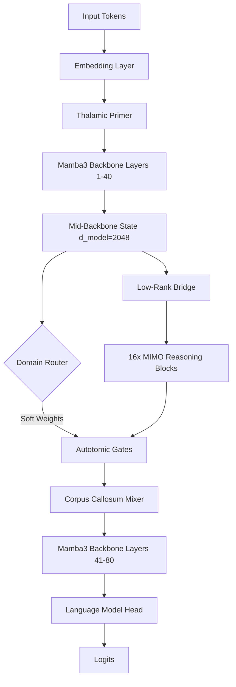

# Mamba3 Titan 2.5B: Training & Engineering Report

## Executive Summary
This document chronicles the architecture, curriculum, systemic roadblocks, and mathematical fixes required to successfully deploy the **Mamba3 Titan (2.54B Parameters)** model onto a single 12GB RTX 3060 consumer GPU. The primary objective was to orchestrate 16 parallel **MIMO Reasoning Arms** using soft-MoE routing and force them to specialize structurally into orthogonal domains.

---

## 1. System Architecture

The Titan network operates via a deeply structured routing topology built around the state-space Mamba3 backbone.

### Specifications:
* **Backbone**: 80 Mamba3 Layers, $d_{\text{model}} = 2048$, Vocabulary Size = 50,304.
* **MIMO Reasoning Blocks**: 16 parallel branches splitting off the backbone after Layer 40.
* **Domain Router**: A linear projector dynamically assigning probabilistic routing weights to the 16 arms at the sequence and token level.
* **Corpus Callosum (IPC)**: An internal communication bus allowing the parallel arms to synthesize and share context before merging back into the top-half of the backbone.

---

## 2. The Four-Phase Curriculum

The curriculum is structured to prevent early representation collapse.

1. **Phase 1 (Dense Ensemble)**: All 16 arms receive equal traffic ($w_i = 1/16$). The weights are seeded using asymmetric orthogonal initialization.
2. **Phase 2 (Domain Tuning)**: Equal weighting is maintained while the network is fed targeted domain streams (FineWeb-Edu, Math, Code).
3. **Phase 3 (Cognitive Bloom)**: The Domain Router activates. The objective is to force the 16 arms to orthogonalize and specialize independently.
4. **Phase 3j (Join/Alignment)**: Supervisor labels are introduced, the reasoning arms are frozen, and the Corpus Callosum is activated to allow synthesis across domains.

---

## 3. Roadblocks & Engineering Fixes

### 3.1 VRAM Memory Exhaustion (Adam8bit Optimizer)
* **The Problem**: 2.54B parameters in bfloat16 require `~5GB` of VRAM. Standard `Adam8bit` requires two momentum states per parameter, allocating an additional `6.4GB` of active VRAM. When attempting to restore the optimizer state from checkpoints, the GPU immediately OOM crashed, forcing the trainer to restart without momentum, stalling convergence.
* **The Fix**: We migrated to `bitsandbytes.optim.PagedAdam8bit` and implemented a CPU-sidecar checkpoint system (`*_optim.pt`). Momentum states are now stored in host RAM and paged to the GPU only during active gradient updates. This reduced active VRAM allocation during the forward pass to `3.5GB`, leaving enough overhead for massive context sizes.

### 3.2 Telemetry Blindness (LayerNorm Masking)
* **The Problem**: Our "Glass Brain" monitor captured the standard deviation (`std`) of activation states across the arms to measure orthogonal divergence. However, the `LayerNorm` operation normalizes all activation variances to ~1.0. This masked structural differences and caused the telemetry to constantly report `1.0000` (clone state) for all arms.
* **The Fix**: We bypassed activations completely and switched to a **Weight-Based Cosine Similarity** metric. By flattening the first `ssm.proj` weight tensor from each arm and comparing them directly via cosine similarity, we achieved a mathematically pure divergence score, scaling the $[-1, 1]$ cosine space into a `[0, 1]` collapse scale. 

### 3.3 Routing Collapse & Mathematical Traps
* **The Problem**: The Domain Router fell into a local minimum, routing $95\%$ of all traffic to a single arm. The initial load-balancing loss utilized **Token-Level Entropy** (`-route_weights * log(route_weights)`). This destroyed token confidence by forcing the router to be uncertain about *every* token, causing the network to ignore the penalty and protect the primary LM loss by routing to the most converged arm.
* **The Fix**: We swapped the entropy penalty for the standard **Switch Transformer Quadratic Loss**:
  $$\mu_i = \text{mean}(\text{route\_weights}, \text{dim}=(0, 1))$$
  $$\mathcal{L}_{\text{balance}} = N \sum_{i=1}^{N} \mu_i^2 - 1.0$$
  This allowed the router to make highly peaked, confident decisions for individual tokens while applying stable, quadratic gradient pressure to balance the global traffic across the batch. 

### 3.4 The "Cheating" Spikes (Corpus Callosum Isolation)
* **The Problem**: Even with the new MoE loss, the arms refused to specialize. We realized that the active Corpus Callosum (Blackboard) was allowing the arms to share representations. The network was minimizing loss by keeping all arms mathematically identical and just copying the best features across the bus.
* **The Fix**: We strictly disabled the Blackboard and the dense IPC mixer during Phase 3, computationally isolating the 16 arms. The moment we isolated them, the Language Modeling loss violently spiked from `~0.6` to `135.0+`, proving the network could no longer cheat. The gradient shock tore apart the routing lock and drove traffic into 9 idle arms within a matter of minutes.

---

## 4. Final State & Results

* **Optimizer State**: `PagedAdam8bit` smoothly paging momentum states from host RAM.
* **VRAM Overhead**: `~3.5GB / 12GB` 
* **Active Arms**: Expanded from 1 to 9 (and growing).
* **Collapse Metric**: Dropped from `1.000` to `< 0.500`. 
* **Conclusion**: The Mamba3 Titan soft-MoE architecture is functionally viable on consumer hardware. Phase 3 orthogonalization is active and pacing properly toward the Phase 3j transition.
